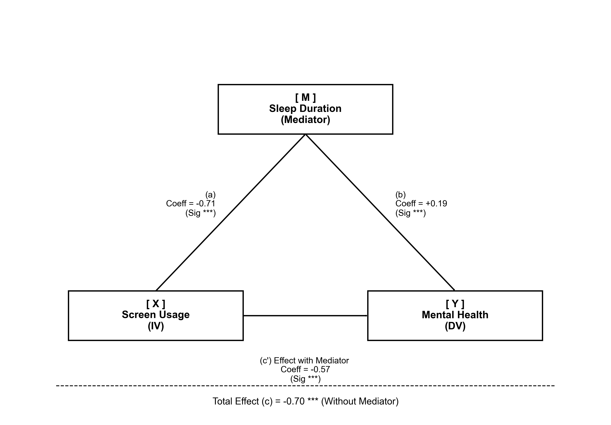

## Abstract

This study examines the relationship between social media usage, sleep duration, digital platform selection and mental health among a sample of students from various global regions. The study tested a mediation hypothesis that sleep deprivation mediates the negative relationship between daily screen usage and mental health scores. Our result support a partial mediation model, indicating that while sleep duration plays a role, it does not fully account for the effect of screen usage on mental health. We further explored the "tipping point" of screen usage, finding that the nagative trend is stepwise; this suggests there is no comparatively 'safe zone' for screen usage. Additionally, the pattern differ by gender, impacting female students more significantly than male students. Findings also suggested that there are significant differences between primary digital platform usage and reported mental health scores.

***note: Please add Ramtin's conclusion***

## Introduction

The pervasive integration of social media platforms into daily lives of students has raised significant concerns regarding its impact on academic performance, psychological health, and interpersonal relationships[@barthorpe2020social; @neophytou2021effects; @naslund2020social]. This study aims to empirically test these relationships among social media habits, sleeping duration, digital platform selection and self-reported mental health, by using a dataset from Kaggle[@kaggle_dataset].

The first research question asks whether sleep deprivation acts as a mediator between screen time and mental health ($RQ_1$). We hypothesized that increased screen time would negatively predict sleep duration, which in turn would degrade mental health scores ($H_1$).

Additionally, we sought to identify a "tipping point" of screen usage where mental health significantly declines ($RQ_2$).We divide students into three groups: minimal (0--3 hours), moderate (3--5 hours), and maximal usage (more than 5 hours). Our hypothesis was that mental health scores would change smoothly between the minimal and moderate groups, but drop drastically for the maximal group ($H_2$). We also hypothesized that these effects might differ across genders ($H_3$).

Our focus next shifted toward potential correlates with specific platform prioritization. In this, we explored how individual platform use was linked to mental health ($RQ_3$), with particular attention paid to lower mental health ratings ($RQ_4$), as well as the hypothesized link of Meta-affiliated platforms (Facebook, Instagram, and WhatsApp) to lower mental health scores ($H_4$). Specific platform usage and its correlation to social media addiction was also examined ($RQ_5$), with Meta-affiliated platforms once again hypothesized to be related, in this case being linked to higher levels of addiction ($H_5$).

***Note: please add on this \@Ramtin***

## Methods

For our first research question, we used three distinct linear regression models, testing the influence of screen time (IV) on sleep (Mediator), the total effect on mental health (DV), and the combined influence of the IV and the mediator on the DV. This path analysis allowed us to build a mediation model step-by-step and assess the mediation effect.

For the second research question, we utilized one-way ANOVA tests on three groups. Separate ANOVA tests were calculated for male and female students, and Tukey HSD post-hoc tests were used following analysis.

For research questions three and five, to compare mental health outcomes and social media addiction scores across different platforms, we computed aggregate statistics (mean and SD) for each platform. As for our fourth research question, we first categorized mental health scores into 'low' and 'not low' groups based on the sample mean. Subsequently, a Pearson's Chi-square test of independence was utilized to validate that the differences observed across digital platforms were statistically significant and not merely due to random chance.

Finally, for our sixth research question, we employed a multiple linear regression model with an interaction term to examine how the relationship between mental health and social media conflict varies by geographic region (USA, Middle East, and Far East). This interaction analysis was supplemented by region-specific Pearson correlation coefficients to quantify the distinct strength of the association within each cultural context.

## Results

```{r}
library(rio)
library(here)
library(tidyverse)
library(tidylog)
library(janitor)
library(skimr)
library(knitr)
library(kableExtra)
```

```{r}
#| results: hide
student_social <- import(here("data", "final_students_social_media.csv"))
head(student_social)
```

```{r}
#| results: hide
tidy_data <- student_social |> 
  pivot_longer(cols = Instagram : last_col(),
               names_to ="Most_Used_Platform",
               values_to = "Avg_Daily_Usage_Hours",
               values_drop_na = TRUE)

head(tidy_data)

export(tidy_data, here("data", "tidy_data.csv"))
```

### Sleep

***RQ***~**1**~**: Does sleep deprivation mediate the negative relationship between daily screen time and mental health scores?**

-   ***H***~**1**~**: Screen time negatively predicts sleep time, which in turn negatively impacts mental health.**

The regression analysis results support the hypothesis that sleep duration partially mediates the relationship between screen time and mental health. First, we plotted the data to demonstrate the negative association between screen time and mental health (Figure 1), as well as screen time and sleep duration (Figure 2). Subsequently, we conducted three linear regression models to test our hypothesis. To better visualize these structural relationships, we generated a path analysis diagram(Figure 3) based on the models' results.

```{r}
#| results: hide

# test mental ~ screen time
model_test <-lm(Mental_Health_Score~Avg_Daily_Usage_Hours,data = tidy_data)
model <- summary(model_test)
b_val <- coef(model_test)[2]
r2_val <- model$r.squared
p_val <- model$coefficients[2, 4]


# test sleep hours ~ screen time
model_path_a <- lm(Sleep_Hours_Per_Night ~ Avg_Daily_Usage_Hours, data = tidy_data)

model_a <- summary(model_path_a)
b_val_a <- coef(model_a)[2]
r2_val_a <- model_a$r.squared
p_val_a <- model_a$coefficients[2, 4]

# test mental ~ screen time + sleep hours
model_full <- lm(Mental_Health_Score ~ Avg_Daily_Usage_Hours + Sleep_Hours_Per_Night, data = tidy_data)


model_all <- summary(model_full)
b_val_all <- coef(model_all)[2]
r2_val_all <- model_all$r.squared
p_val_all <- model_all$coefficients[2, 4]


#plot
ggplot(tidy_data,
       aes(x= Avg_Daily_Usage_Hours, y= Mental_Health_Score))+
  geom_smooth(model= "lm", se= TRUE)+
  labs(title = "Figure 1: Relationship between Screen Time and Mental Health")+
  theme_minimal()+
  theme(plot.title = element_text(size =10))


ggplot(tidy_data,
       aes(x= Avg_Daily_Usage_Hours, y= Sleep_Hours_Per_Night))+
  geom_smooth(model= "lm", se= TRUE, color = "red")+
  labs(title = "Figure 2: Relationship between Screen Time and Sleep hours")+
  theme_minimal()+
  theme(plot.title = element_text(size =10))


```



First, Model a showed that screen usage also significantly negatively predicted sleep duration (b = `r round(b_val_a, 2)`, p`r scales::pvalue(p_val_a)`, $R^2$ = `r round(r2_val_a, 2)`), confirming the path from the independent variable to the mediator.

Second, Model c revealed a significant total effect, where daily screen usage negatively predicted mental health scores (b = `r round(b_val, 2)`, p`r scales::pvalue(p_val)`, $R^2$ = `r round(r2_val, 2)` ).

Finally, in Model c', when both screen usage and sleep duration were included, sleep duration was positively associated with mental health. Screen time continued to negatively predict mental health even after controlling for sleep duration(b = `r round(b_val_all, 2)`, p`r scales::pvalue(p_val_all)`, $R^2$ = `r round(r2_val_all, 2)`). Notably, while the direct effect of screen usage on mental health remained significant, the coefficient decreased from -0.70 to -0.57.

This reduction in the coefficient suggests that sleep duration partially mediates the negative impact of screen time on mental health.

***RQ***~**2**~**:Is there a critical 'tipping point' in screen usage where sleep duration and mental health exhibit a sharp decline?**

-   ***H***~**2**~**: Students exceeding a threshold of 5 hours per day will report significantly worse outcomes compared to low-usage groups, whereas the difference between low (0\~3) and moderate usage (3\~5)may be minimal.**
-   ***H***~**3**~**: However, this pattern may vary by gender, and the differences in outcomes may not be the same across male and female students.**

```{r}
#| results: hide
group_data <- tidy_data |> 
  mutate(Usage_Group = cut(
      Avg_Daily_Usage_Hours,
      breaks = c(0, 3, 5, Inf),
      labels = c("Low (0–3h)", "Moderate (3–5h)", "High (>5h)"))
      ) 

male_data <- group_data |> 
  filter(Gender == "Male") |> 
  select(Gender, Avg_Daily_Usage_Hours, Sleep_Hours_Per_Night,Mental_Health_Score,Usage_Group) 


female_data <- group_data |> 
  filter(Gender == "Female") |> 
  select(Gender, Avg_Daily_Usage_Hours, Sleep_Hours_Per_Night,Mental_Health_Score,Usage_Group)
```

As we mentioned before, three groups were divided by their screen use time, and the figure 4 does show a negative effect of daily screen time on mental health, but there is no clear "tipping point." Instead, the decline appears more stepwise, with mental health decreasing gradually across each usage group, which means $H_2$ was not supported.

The most interesting finding is that the downward trend is evident for both genders, but the decline is notably steeper among female students, especially in the high-usage category, suggesting that excessive screen exposure may have a stronger negative impact on females' psychological well-being.

```{r}
summary_data <- group_data |>
  group_by(Gender, Usage_Group) |>
  summarise(
    mean_MH = mean(Mental_Health_Score),
    sd_MH   = sd(Mental_Health_Score),
    n       = n(),
    se_MH   = sd_MH / sqrt(n) 
  ) |>
  ungroup()

ggplot(summary_data,
       aes(x = Usage_Group,
           y = mean_MH,
           group = Gender,
           color = Gender)) +
  geom_point(position = position_dodge(width = 0.2), size = 1) +
  geom_line(position = position_dodge(width = 0.2)) +
  geom_errorbar(
    aes(ymin = mean_MH - se_MH,
        ymax = mean_MH + se_MH),
    width = 0.1,
    position = position_dodge(width = 0.2)
  ) +
  labs(
    x = "Daily Screen Time Group",
    y = "Mean Mental Health Score",
    color = "Gender",
    title = "Figure 4: Mental Health by Screen Time Group and Gender"
  ) +
  theme_minimal()

```

```{r}
#| results: hide
#one-way ANOVAs
anova_male <- aov(Mental_Health_Score ~ Usage_Group, data = male_data)
tukey_male_res <- TukeyHSD(anova_male)

anova_female <- aov(Mental_Health_Score ~ Usage_Group, data = female_data)
tukey_female_res <- TukeyHSD(anova_female)

diff_m_mod_low  <- tukey_male_res$Usage_Group["Moderate (3–5h)-Low (0–3h)", "diff"]
diff_m_high_mod <- tukey_male_res$Usage_Group["High (>5h)-Moderate (3–5h)", "diff"]

diff_f_mod_low  <- tukey_female_res$Usage_Group["Moderate (3–5h)-Low (0–3h)", "diff"]
diff_f_high_mod <- tukey_female_res$Usage_Group["High (>5h)-Moderate (3–5h)", "diff"]

p_m_all <- tukey_male_res$Usage_Group[, "p adj"]   
p_f_all <- tukey_female_res$Usage_Group[, "p adj"]

```

To statistically verify the patterns observed in the plot, we conducted separate one-way ANOVAs for male and female students. Also, we conducted Tukey HSD post-hoc analysis. The results show that significant declines across all usage levels for both male(all ps \<.001) and female(all ps \<.001). For male students, mental health scores dropped by `r round(abs(diff_m_mod_low),2)` points from the Low to Moderate group, and by another `r round(abs(diff_m_high_mod),2)` points from the Moderate to High group.

In contrast, female students showed an accelerating decline. While the drop from Low to Moderate usage was `r round(abs(diff_f_mod_low),2)` points, the decline became much steeper, dropping by `r round(abs(diff_f_high_mod),2)` points, when moving from Moderate to High usage. This indicates that excessive screen time (\>5h) may have a more severe marginal impact on female students. Therefore, $H_3$ was supported.

### Platform Use

***RQ***~**3**~**: How does primary usage of a specific social media platform impact mental health?**

-   ***H***~**4**~**: Prioritized use of Meta-affiliated platforms, such as Facebook, Instagram, and WhatsApp, will result in a greater negative impact to mental health compared to other platforms.**

```{r}
#| echo: false

platform_use <- tidy_data |> 
  mutate(
    Most_Used_Platform = factor(Most_Used_Platform),
    Gender = factor(Gender),
    Academic_Level = factor(Academic_Level),
    Country = factor(Country)
  )

platform_mental_health <- platform_use |> 
  group_by(Most_Used_Platform) |> 
  summarize(
    n = n(),
    mean_pmh = mean(Mental_Health_Score, na.rm = TRUE),
    sd_pmh = sd(Mental_Health_Score, na.rm = TRUE)
  ) |> 
  arrange(desc(mean_pmh)) |> 
  rename(
    `Most Used Platform` = Most_Used_Platform,
    Mean = mean_pmh,
    `Standard Deviation` = sd_pmh
  )
```

To first understand the relationship between respondents indicating a specific platform as their most-used and reported mental health, data was associated between platform use and average mental health, as modeled below.

```{r}
platform_mental_health |> 
  kable(
    caption = "Mean Mental Health Scores by Platform",
    digits = 2
  ) |> 
  kable_styling(full_width = FALSE) |> 
  row_spec(5, bold = TRUE) |> 
  row_spec(8, bold = TRUE) |> 
  row_spec(12, bold = TRUE)
```

Our results varied when testing the affiliated hypothesis: while Facebook and Instagram did not link to lower reported mental health statuses (*M~F~* = `r round(platform_mental_health[["Mean"]][ platform_mental_health[["Most Used Platform"]] == "Facebook" ], 2)`, *SD~F~* = `r round(platform_mental_health[["Standard Deviation"]][ platform_mental_health[["Most Used Platform"]] == "Facebook" ], 2)`; *M~I~* = `r round(platform_mental_health[["Mean"]][ platform_mental_health[["Most Used Platform"]] == "Instagram" ], 2)`, *SD~I~* = `r round(platform_mental_health[["Standard Deviation"]][ platform_mental_health[["Most Used Platform"]] == "Instagram" ], 2)`), users who reported WhatsApp as their most-used digital platform exhibited the lowest mental health scores of all respondents (*M* = `r round(platform_mental_health[["Mean"]][ platform_mental_health[["Most Used Platform"]] == "WhatsApp" ], 2)`, *SD* = `r round(platform_mental_health[["Standard Deviation"]][ platform_mental_health[["Most Used Platform"]] == "WhatsApp" ], 3)`). As such, $H_4$ was only partially supported.

***RQ***~**4**~**: Do any specific social media platforms significantly correlate to lower self-reported mental health statuses?**

```{r}
#| echo: false

pu_mean_mh <- mean(platform_use$Mental_Health_Score, na.rm = TRUE)

platform_use <- platform_use |> 
  mutate(
    low_mh = if_else(Mental_Health_Score < pu_mean_mh, "Low", "Not Low"),
    low_mh = factor(low_mh, levels = c("Low", "Not Low"))
  )

mh_count <- platform_use |> 
  group_by(Most_Used_Platform, low_mh) |> 
  summarize(
    n = n(),
    .groups = "drop"
  )

mh_wide <- mh_count |> 
  pivot_wider(
    names_from = low_mh,
    values_from = n,
    values_fill = 0
  )

mh_wide <- mh_wide |> 
  mutate(
    total = Low + `Not Low`,
    pct_low = Low / total * 100,
    pct_not_low = `Not Low` / total * 100
  ) |> 
  mutate(
    pct_low = round(pct_low, 1),
    pct_not_low = round(pct_not_low, 1)
  ) |> 
  rename(
    `Most Used Platform` = Most_Used_Platform,
    Total = total,
    `Low (%)` = pct_low,
    `Not Low (%)` = pct_not_low
  ) |> 
  arrange(desc(`Low (%)`))
```

Our focus next looked at possibly significant correlations between specific platform prioritization and what we deemed as "low mental heath." From our data, "low mental health" was characterized as any respondents whose mean mental health score was returned as being lower than the cumulative average mental health score from all respondents. This then grouped respondents into either a "low" or a "not low" group, represented below based on percentage of respondents, to see if any specific platform had a significantly larger population of "low" respondents compared to those who were "not low."

```{r}
mh_wide |>
  select(-Low, -`Not Low`, -Total) |> 
  kable(
    caption = "Percentages of Lower Than Average Mental Health Reports by Platform",
    digits = 3
  ) |> 
  kable_styling(full_width = FALSE) |> 
  row_spec(2, bold = TRUE) |> 
  row_spec(5, bold = TRUE) |> 
  row_spec(9, bold = TRUE)
```

Based on these findings, the majority of those who primarily use Instagram, KakaoTalk, Snapchat, TikTok, WeChat, and WhatsApp have lower-than-average reported mental health. As well, $H_4$ continued to be partially supported, with both WhatsApp (`r mh_wide[["Low (%)"]][ mh_wide[["Most Used Platform"]] == "WhatsApp" ]`%) and Instagram (`r mh_wide[["Low (%)"]][ mh_wide[["Most Used Platform"]] == "Instagram" ]`%) having the majority of their grouped respondents also reporting lower then average mental health, while Facebook (`r mh_wide[["Low (%)"]][ mh_wide[["Most Used Platform"]] == "Facebook" ]`%) did not have its majority in the lower group.

```{r}
#| results: false

mh_chi <- mh_wide |> 
  select(Low, `Not Low`) |> 
  as.matrix()

rownames(mh_chi) <- mh_wide$Most_Used_Platform

mh_chi <- chisq.test(mh_chi)

mh_chi
```

Using a chi-square test of independence, we sought to measure if these differences reflect a statistically significant relationship. Our results indicated a significant association between primary platform use and reported mental health status (χ² = 226.05, *df* = 11, *p* \< .001), suggesting that low versus not-low mental health frequencies vary across platforms to a noteworthy degree.

***RQ***~**5**~**: Do any specific platforms correlate to higher levels of social media addiction?**

-   ***H***~**5**~**: Prioritized use of Meta-affiliated platforms, such as Facebook, Instagram, and WhatsApp, will result in higher levels of social media addiction compared to other platforms.**

```{r}
#| echo: false

platform_addiction <- platform_use |> 
  group_by(Most_Used_Platform) |> 
  summarize(
    n = n(),
    mean_addiction = mean(Addicted_Score, na.rm = TRUE),
    sd_addiction = sd(Addicted_Score, na.rm = TRUE)
  ) |> 
  rename(
    `Most Used Platform` = Most_Used_Platform,
    `Mean` = mean_addiction,
    `Standard Deviation` = sd_addiction
  ) |> 
  arrange(desc(`Mean`))
```

For the last research question and associated hypothesis pertaining to platform usage, we examined reported levels of addiction to social media in general based on the platform most used by the respondent in an attempt to determine if prioritized usage of any specific platform was linked to higher levels of addiction. These results were reported as means based on each group, displayed below.

```{r}
platform_addiction |> 
  kable(
    caption = "Social Media Addiction by Platform",
    digits = 2
  ) |> 
  kable_styling(full_width = FALSE) |> 
  row_spec(1, bold = TRUE) |> 
  row_spec(4, bold = TRUE) |> 
  row_spec(8, bold = TRUE)
```

The resulting data indicated that those who reported using WhatsApp or Snapchat the most also reported the highest level of addiction to social media (*M~WA~* = `r round(platform_addiction[["Mean"]][ platform_addiction[["Most Used Platform"]] == "WhatsApp" ], 2)`, *SD* = `r round(platform_addiction[["Standard Deviation"]][ platform_addiction[["Most Used Platform"]] == "WhatsApp" ], 2)`; *M~S~* = `r round(platform_addiction[["Mean"]][ platform_addiction[["Most Used Platform"]] == "Snapchat" ], 2)`, *SD* = `r round(platform_addiction[["Standard Deviation"]][ platform_addiction[["Most Used Platform"]] == "Snapchat" ], 2)`), closely followed by those who reported TikTok as their most used platform (*M* = `r round(platform_addiction[["Mean"]][ platform_addiction[["Most Used Platform"]] == "TikTok" ], 2)`, *SD* = `r round(platform_addiction[["Standard Deviation"]][ platform_addiction[["Most Used Platform"]] == "TikTok" ], 2)`). Those who reported using LINE as their most used platform reported the lowest level of addiction to social media (*M* = `r round(platform_addiction[["Mean"]][ platform_addiction[["Most Used Platform"]] == "LINE" ], 2)`, *SD* = `r round(platform_addiction[["Standard Deviation"]][ platform_addiction[["Most Used Platform"]] == "LINE" ], 2)`).

Similar to $H_4$, $H_5$ was partially supported by these findings, with WhatsApp's prioritized usage having the highest level of reported social media addiction and Instagram not far behind; Facebook, in contrast, reported a near-average level of social media addiction (*M* = `r round(platform_addiction[["Mean"]][ platform_addiction[["Most Used Platform"]] == "Facebook" ], 2)`, *SD* = `r round(platform_addiction[["Standard Deviation"]][ platform_addiction[["Most Used Platform"]] == "Facebook" ], 2)`).

### Region

(for Ramtin's results)

## Discussion

(mention loose definition of "social media" as a limitation, where not all platforms serve the same purpose. mention "low mental health" determination as a limitation, as this is not built on any existing scale in which a specific number or lower means "low" mental health.)

(Febe's limitations, if any.)

(Ramtin's limitations, if any.)

## References
